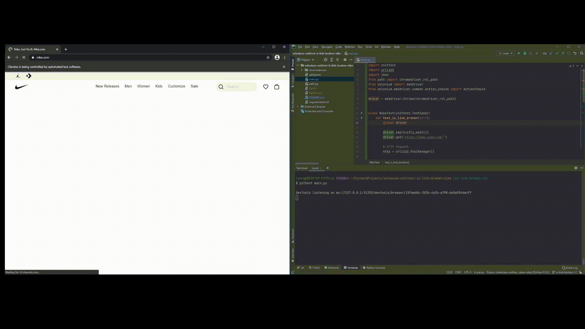

# selenium-unittest-is-link-broken-nike

## Demo

&ensp;&ensp;&ensp;&ensp;[YouTube](https://www.youtube.com/watch?v=9fV-vL9NIEQ)



## Console Output

```json
{
  "status_code": 200,
  "text": "Shop All New Arrivals",
  "url": "https://www.nike.com/w/new-3n82y"
}
{
  "status_code": 200,
  "text": "SNKRS Launch Calendar",
  "url": "https://www.nike.com/launch"
}
{
  "status_code": 200,
  "text": "Best of Air Max",
  "url": "https://www.nike.com/w/air-max-shoes-a6d8hzy7ok"
}
{
  "status_code": 200,
  "text": "Member Access",
  "url": "https://www.nike.com/w/member-access-4lbty"
}
{
  "status_code": 200,
  "text": "Spring Break Styles",
  "url": "https://www.nike.com/w/spring-break-essentials-71xbh"
}
{
  "status_code": 200,
  "text": "New Spring Essentials",
  "url": "https://www.nike.com/w/spring-essentials-88n3m"
}
{
  "status_code": 200,
  "text": "New For Men",
  "url": "https://www.nike.com/w/new-mens-3n82yznik1"
}
{
  "status_code": 200,
  "text": "Shoes",
  "url": "https://www.nike.com/w/new-mens-shoes-3n82yznik1zy7ok"
}
{
  "status_code": 200,
  "text": "Clothing",
  "url": "https://www.nike.com/w/new-mens-clothing-3n82yz6ymx6znik1"
}
{
  "status_code": 200,
  "text": "Equipment",
  "url": "https://www.nike.com/w/new-mens-accessories-equipment-3n82yzawwpwznik1"
}
{
  "status_code": 200,
  "text": "Shop All New",
  "url": "https://www.nike.com/w/new-mens-3n82yznik1"
}
{
  "status_code": 200,
  "text": "New For Women",
  "url": "https://www.nike.com/w/new-womens-3n82yz5e1x6"
}
{
  "status_code": 200,
  "text": "Shoes",
  "url": "https://www.nike.com/w/new-womens-shoes-3n82yz5e1x6zy7ok"
}
{
  "status_code": 200,
  "text": "Clothing",
  "url": "https://www.nike.com/w/new-womens-clothing-3n82yz5e1x6z6ymx6"
}
{
  "status_code": 200,
  "text": "Equipment",
  "url": "https://www.nike.com/w/new-womens-accessories-equipment-3n82yz5e1x6zawwpw"
}
{
  "status_code": 200,
  "text": "Shop All New",
  "url": "https://www.nike.com/w/new-womens-3n82yz5e1x6"
}
{
  "status_code": 200,
  "text": "New For Kids",
  "url": "https://www.nike.com/w/new-kids-3n82yzv4dh"
}
{
  "status_code": 200,
  "text": "Boys Shoes",
  "url": "https://www.nike.com/w/new-boys-shoes-1onraz3n82yzy7ok"
}
{
  "status_code": 200,
  "text": "Boys Clothing",
  "url": "https://www.nike.com/w/new-boys-clothing-1onraz3n82yz6ymx6"
}
{
  "status_code": 200,
  "text": "Girls Shoes",
  "url": "https://www.nike.com/w/new-girls-shoes-3aqegz3n82yzy7ok"
}
{
  "status_code": 200,
  "text": "Girls Clothing",
  "url": "https://www.nike.com/w/new-girls-clothing-3aqegz3n82yz6ymx6"
}
{
  "status_code": 200,
  "text": "Shop All New",
  "url": "https://www.nike.com/w/new-kids-3n82yzv4dh"
}
.
----------------------------------------------------------------------
Ran 1 test in 26.711s

OK
```

## Supported Operating Systems

* Linux
* Mac
* Windows

## System Requirements

| Technology |      Version       |
| :---       |       :---:        |
| python     | >= 3               |
| pip        | >= 21              |
| Chrome     | >= 88.0.4324.96    |

## Getting Started

### 1. Clone Repository
```sh
  $ git clone https://github.com/alec-leong/selenium-unittest-is-link-broken-nike.git
```

### 2. Change Directory
```sh
  $ cd selenium-unittest-is-link-broken-nike/
```

### 3. Install Dependencies
```sh
  /selenium-unittest-is-link-broken-nike$ python -m pip install -r requirements.txt
```

### 4. Execute Program
```sh
  /selenium-unittest-is-link-broken-nike$ python main.py
```
